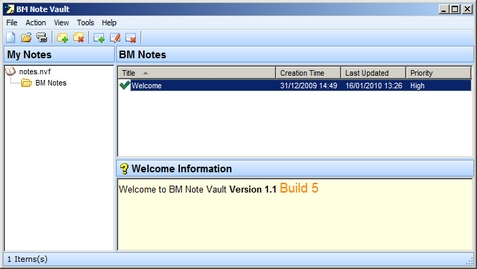



## BM Note Vault

### Description

BM Note Vault is an easy to use freeware notes organizer that

allows you to manage your personal and business related information,

Ideas into manageable groups.

Hope you like this code, as this will be my last submission to the VB selection as I now moved over to C#, it been fun over the years thanks for all the good commects and votes on my submissions and I wish you all the best. Maybe we meet in the C# selection.
 
### More Info
 

             |
---                |---
**Submitted On**   |2010-03-02 14:05:58
**By**             |[dreamvb](https://github.com/Planet-Source-Code/PSCIndex/blob/master/ByAuthor/dreamvb.md)
**Level**          |Intermediate
**User Rating**    |5.0 (45 globes from 9 users)
**Compatibility**  |VB 6\.0
**Category**       |[Complete Applications](https://github.com/Planet-Source-Code/PSCIndex/blob/master/ByCategory/complete-applications__1-27.md)
**World**          |[Visual Basic](https://github.com/Planet-Source-Code/PSCIndex/blob/master/ByWorld/visual-basic.md)
**Archive File**   |[BM\_Note\_Va2183716272010\.zip](https://github.com/Planet-Source-Code/dreamvb-bm-note-vault__1-73240/archive/master.zip)

